# TravelWise

### Cross-Platform Development - Assignment 1

### **A Plus Group**

# Screenshots - iOS

## WelcomeScreen

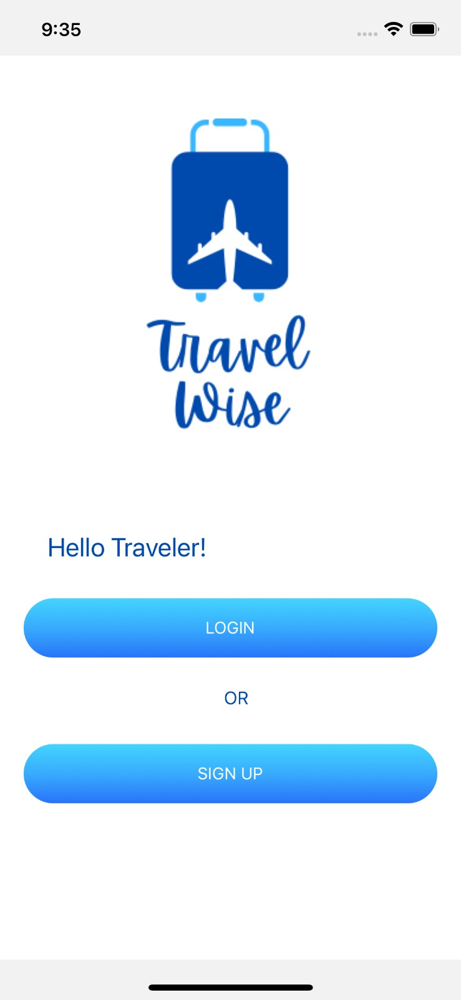

## LoginScreen

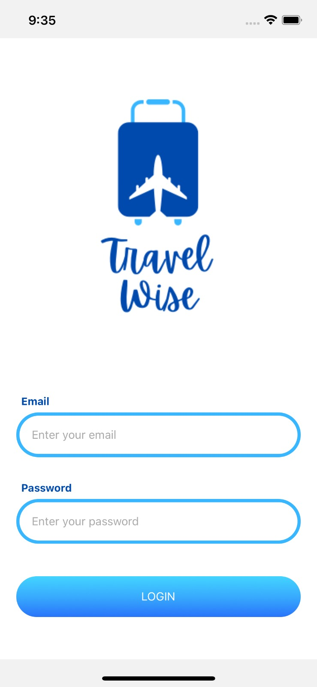

## SignupScreen

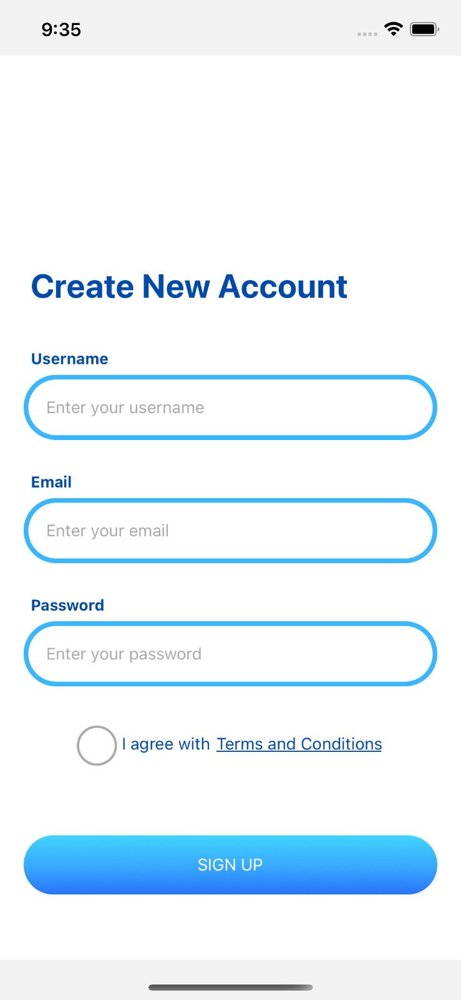

## HomeScreen

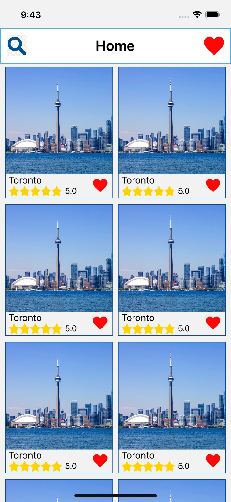

## DetailsScreen

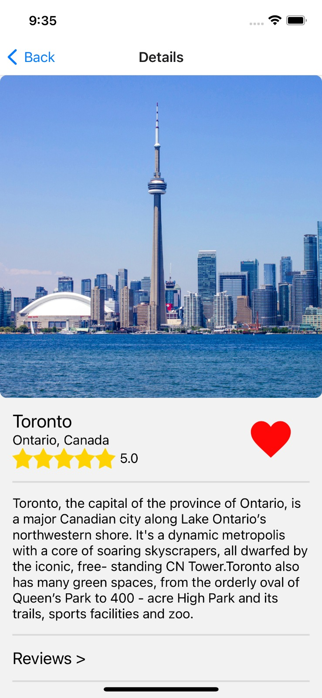

## ReviewsScreen

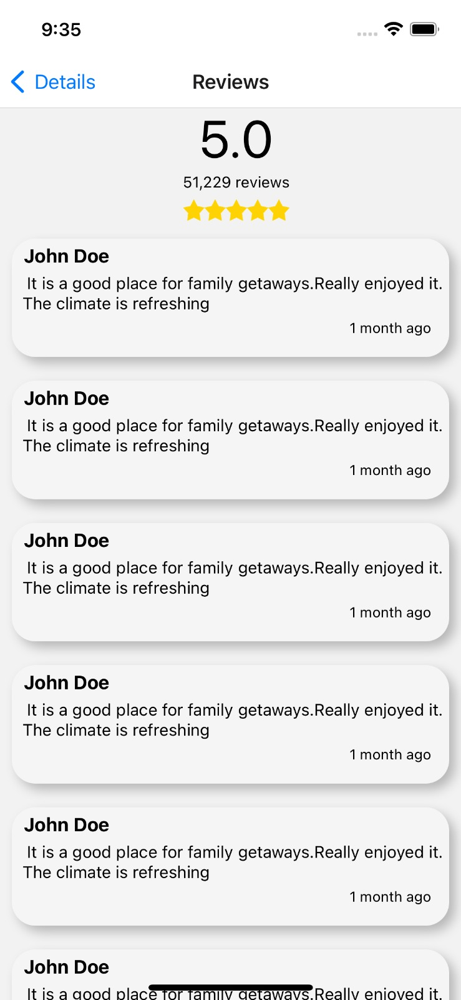

## FavoritesScreen

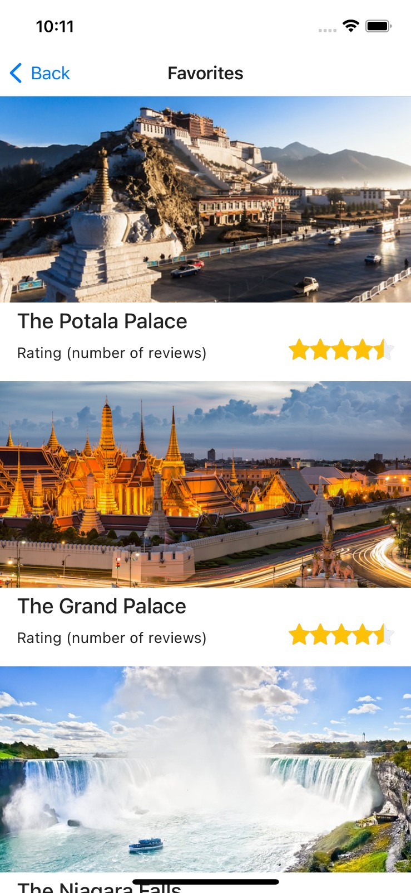

# Screenshots - Android

## WelcomeScreen

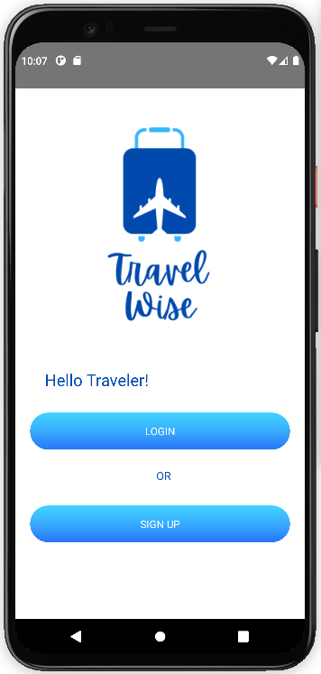

## LoginScreen

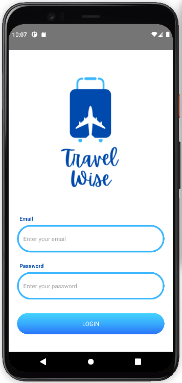

## SignupScreen

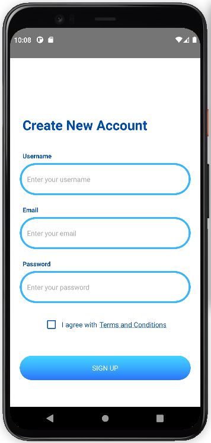

## HomeScreen

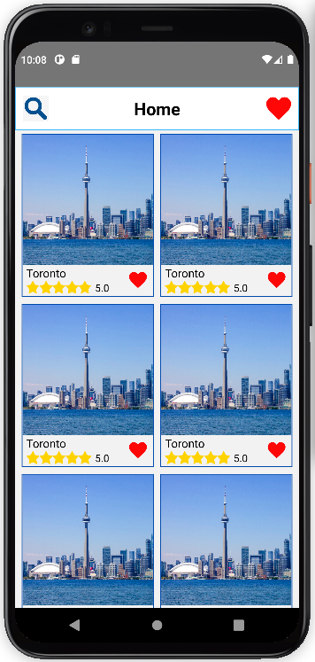

## DetailsScreen

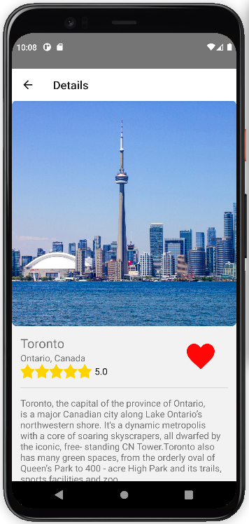

## ReviewsScreen

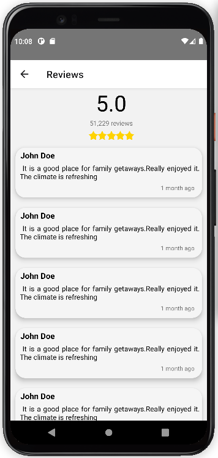

## FavoritesScreen

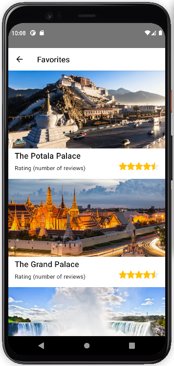
